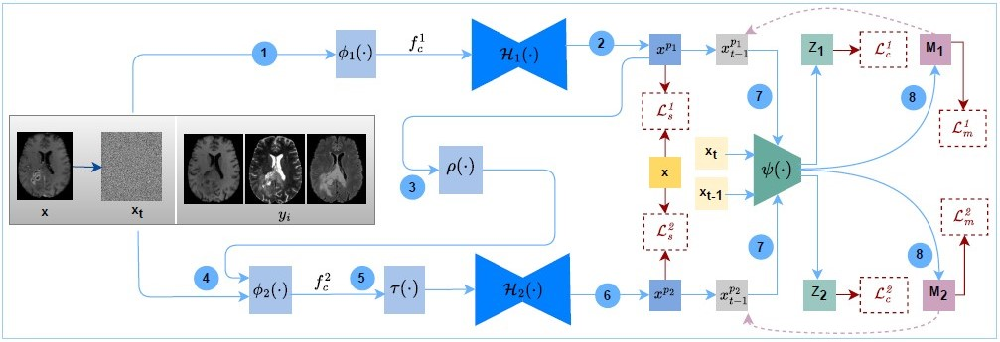
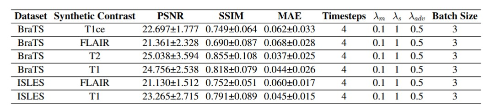

# MU-Diff: A Mutual Learning Diffusion Model for Synthetic MRI with Application for Brain lesions

This repo contains the supported pytorch code and configurations for the [Mutual Learning Diffusion Model for Synthetic MRI with Application for Brain lesions Article](https://www.nature.com/articles/s44387-025-00016-8?utm_source=rct_congratemailt&utm_medium=email&utm_campaign=oa_20250707&utm_content=10.1038/s44387-025-00016-8).

**Abstract**  <br />
Synthesizing brain MRI lesions poses significant challenges due to the heterogeneity of lesion characteristics and the complexity of capturing fine-grained pathological information across MRI contrasts. This is particularly challenging when synthesizing contrast-enhanced MRIs, as it requires modelling subtle contrast changes to enhance lesion visibility. Additionally, effectively leveraging of the complementary information across multiple contrasts remains difficult due to their diverse feature representations. To address these challenges, we propose a mutual learning-based framework for brain lesion MRI synthesis using an adversarial diffusion approach. Our framework employs two mutually learned denoising networks with distinct roles: one focuses on capturing contrast-specific features to handle the diverse feature representations across multiple contrasts, while the other emphasizes contrast-aware adaptation to model subtle and fine-grained pathological variations. A shared critic network ensures mutual consistency between the networks, ensuring collaborative learning and efficient information sharing. Furthermore, the critic network facilitates the identification of critical lesion regions through uncertainty estimation, directing more attention to these areas during synthesis. We benchmark our approach against state-of-the-art generative architectures, multi-contrast MRI synthesis methods, and conventional diffusion models on two public lesion datasets. We consider each contrast a missing target in different tasks. Additionally, we validate our method on a similar brain tumour dataset and an in-house healthy dataset. Results show that our method outperforms other baselines, delivering accurate lesion synthesis. To further demonstrate the diagnostic value of our synthetic images, we conducted a downstream segmentation evaluation, which revealed superior performance, particularly in challenging synthesis tasks, indicating the plausibility and accuracy of the proposed lesion MRI synthesis method.

**MU-Diff Architecture**  <br />



**System Requirement**  <br />
All the experiments of MU-Diff are conducted on Ubuntu 20.04 Focal version with Python 3.8.

To train MU-Diff with the given settings, the system requires a GPU with at least 40GB. All the experiments are conducted on two Nvidia A40 GPUs. (Not required any non-standard hardware)
To test the model's performance on BraTS and ISLES test data, the system requires a GPU with at least 4 GB. <br />  <br />
***Installation Guide***  <br />
Prepare an environment with python>=3.8 and install dependencies
```
pip install -r requirements.txt
```
***Installation Time***  <br />
This depends on the internet connection speed. It would take around 20-30 minutes to create an environment and install all the dependencies required.


**Dataset Preparation**  <br />
The experiments are conducted on two publicly available datasets,
  * BraTS2019 Dataset : [https://www.med.upenn.edu/cbica/brats2019/data.html](https://www.med.upenn.edu/cbica/brats2019/data.html)
  * ISLES2015 Dataset : [https://www.isles-challenge.org/ISLES2015/](https://www.isles-challenge.org/ISLES2015/)

The data split of each dataset is listed in the [data](data) folder. Sperate each MRI contrast into folders and run pre_process.py to normalize data and extract middle axial slices from nifty files. 
```
python pre_process.py
```
This will save the extracted 2D slices from each contrast as [contrast_name].npy.  Then, save the .npy data as in the following structure.
```
data/
├── BRATS/
│   ├── train/
│   │   ├── T1.npy
│   │   └── T2.npy
│   │   └── FLAIR.npy
│   │   └── T1CE.npy
│   ├── test/
│   │   ├── T1.npy
│   │   └── T2.npy
│   │   └── FLAIR.npy
│   │   └── T1CE.npy
│   ├── val/
│   │   ├── T1.npy
│   │   └── T2.npy
│   │   └── FLAIR.npy
│   │   └── T1CE.npy
```

**Figshare Project**  <br />
All the pre-trained model weights, generated brain masks and evaluations are included in this [project page](https://figshare.com/account/home#/projects/230277)

**Model Weights** <br />
Download trained models from [project page](https://figshare.com/account/home#/projects/230277)
**DOI** : [https://doi.org/10.6084/m9.figshare.27965493](https://doi.org/10.6084/m9.figshare.27965493)

**Demo** <br />
The demonstration is created on synthesising T1ce contrast on the BraTS dataset. You can run the given Python notebook in the demo folder by using the sample test data provided. You can also update the model weights and try different synthesis tasks.

**Train Model**  <br />
To train the model on the brats dataset.
```
python train.py --image_size 256 --exp exp_brats --num_channels 1 --num_channels_dae 64 --ch_mult 1 2 4 --num_timesteps 4 --num_res_blocks 2 --batch_size 3 --num_epoch 30 --ngf 64 --embedding_type positional --ema_decay 0.999 --r1_gamma 1. --z_emb_dim 256 --lr_d 1e-4 --lr_g 1.6e-4 --lazy_reg 10 --num_process_per_node 3
```
To train the model on ISLES dataset, use the same cmd, update the experiment name (--exp) and update the dataset script used within the train.py  (use dataset_isles.py)

**Hyperparameter Setting and Experimental Results.**  <br />


The order of the contrasts in the dataset_brats.py and dataset_isles.py follows [cond_contrast1, cond_contrast2, cond_contrast3, **target_contrast** ]<br /> 
To reproduce the results using the pre-trained weights, follow the order of contrast loading in datasets.

**BraTS** : [Flair,T2,T1,**T1ce**], [T1ce,T1,T2,**Flair**], [T1ce,T1,Flair,**T2**],  [Flair,T1ce,T2,**T1**]<br /> 

**ISLES** : [T1,T2,DWI,**Flair**], [T2,DWI,Flair,**T1**]

**Test Model**  <br />
```
python test.py --image_size 256 --exp exp_brats --num_channels 1 --num_channels_dae 64 --ch_mult 1 2 4 --num_timesteps 4 --num_res_blocks 2 --batch_size 1 --embedding_type positional  --z_emb_dim 256  --gpu_chose 0 --input_path '/data/BRATS' --output_path '/results'
```
**Evaluation of Synthetic Results**  <br />
During the testing phase, save each synthesized and group truth contrast in separate folders and use their folder paths to execute metric_calc.py to evaluate the results quantitatively.
```
python metric_calc.py
```
**Acknowledgements**  <br />
This repository makes liberal use of code from [Tackling the Generative Learning Trilemma](https://github.com/NVlabs/denoising-diffusion-gan) and [SynDiff](https://github.com/icon-lab/SynDiff)
